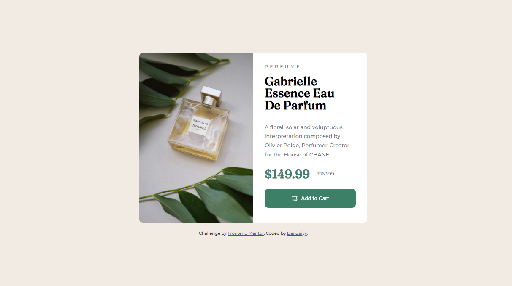

# Solution for Frontend Mentor - Product preview card component

## Bonjour! 👋🏼

Je vous partage mon deuxième challenge [Frontend Mentor](https://www.frontendmentor.io).
J'espère ne pas faire trop d'erreur pour l'apprentissage des différents langage sur le site.

## Le déroulement du challenge

- Structurer l'HTML pour version desktop
- Mettre en oeuvre le CSS pour version desktop
- Mettre en place le responsive pour version mobile

## Les retours

Je suis presser d'avoir vos retours sur ce second challenge réaliser, afin de pouvoir m'améliorer dans le temps au fur et à mesure des challenges.

## Reseaux

Vous pouvez me retrouver sur ces différents réseaux :

- [Twitch (Game)](https://www.twitch.tv/denzaiyy)
- [Twitch (Dev)](https://www.twitch.tv/denz_web)
- [Twitter](https://twitter.com/denzaiyy)
- [Discord](https://www.discord.gg/FRyBQXY)

**Merci à vous! ❤️**